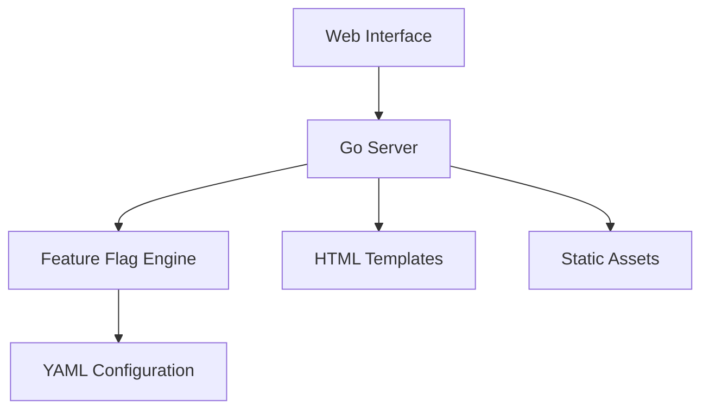

# Feature Flag Management System

A powerful and user-friendly feature flag management system built with Go, allowing you to control feature rollouts and A/B testing through a web interface. This system provides a complete solution for managing feature flags, user targeting, and feature rollouts in your applications.

## 📋 Table of Contents

- [Features](#-features)
- [Architecture](#-architecture)
- [Getting Started](#-getting-started)
- [Detailed Usage Guide](#-detailed-usage-guide)
- [API Reference](#-api-reference)
- [Configuration Guide](#-configuration-guide)
- [Technical Details](#-technical-details)
- [Security](#-security)
- [Troubleshooting](#-troubleshooting)
- [Contributing](#-contributing)
- [License](#-license)

## 🌟 Features

### Core Features

| Feature | Description | Benefits |
|---------|-------------|----------|
| Web Admin Interface | Browser-based management console | Easy access, no CLI required |
| Real-time Updates | 3-second polling interval | Immediate feedback |
| User Targeting | Rule-based feature access | Granular control |
| Feature Variations | Multiple states per feature | Flexible configuration |

### Feature Flag Management

- **Global Controls**
  - Enable/disable features system-wide
  - Set default states
  - Configure fallback behaviors

- **Targeting Rules**
  - Key-value based targeting
  - Multiple rules per feature
  - Rule priority management
  - Custom rule conditions

- **Monitoring**
  - Real-time status updates
  - Visual status indicators
  - Change history tracking
  - Usage statistics

## 🏗️ Architecture

### System Components



### Directory Structure

```
flagger/
├── main.go              # Main application entry point
├── flags.yaml          # Feature flag configurations
├── go.mod              # Go module definition
├── go.sum              # Go module checksums
├── static/             # Static assets
│   └── css/
│       └── style.css   # Stylesheet
└── templates/          # HTML templates
    ├── dashboard.html  # Dashboard template
    └── admin.html      # Admin panel template
```

## 🚀 Getting Started

### Prerequisites

| Requirement | Version | Purpose |
|-------------|---------|---------|
| Go | ≥ 1.16 | Runtime and compilation |
| Git | Latest | Version control |
| Web Browser | Modern | Admin interface access |

### Installation

1. **Clone the Repository**
   ```bash
   git clone <repository-url>
   cd flagger
   ```

2. **Install Dependencies**
   ```bash
   go mod tidy
   ```

3. **Verify Installation**
   ```bash
   go run main.go
   ```

4. **Access the Application**
   - Dashboard: http://localhost:8080/dashboard
   - Admin Panel: http://localhost:8080/admin

## 📋 Detailed Usage Guide

### Dashboard Interface

#### Quick Toggle Links

| Button | Action | Effect |
|--------|--------|--------|
| Enable All | Sets all features to enabled | Global enable |
| Disable All | Sets all features to disabled | Global disable |
| Reset | Returns to default state | Reset to defaults |

#### Feature Status Display

```html
<div class="status-indicator {{if .Feature}}active{{else}}inactive{{end}}">
    <span class="status-label">Feature Name:</span>
    <span class="status-value">{{if .Feature}}Enabled{{else}}Disabled{{end}}</span>
</div>
```

### Admin Panel

#### Feature Management

1. **Default Variation Setting**
   ```yaml
   feature-name:
     defaultRule:
       variation: enabled  # or disabled
   ```

2. **Targeting Rule Configuration**
   ```yaml
   targeting:
     - query: "user.role == 'admin'"
       variation: enabled
     - query: "user.plan == 'premium'"
       variation: enabled
   ```

#### Rule Management

| Operation | Method | Example |
|-----------|--------|---------|
| Add Rule | UI Button | Click "Add Rule" |
| Remove Rule | UI Button | Click "×" |
| Edit Rule | Direct Edit | Modify input fields |
| Reorder Rules | Drag & Drop | Move rules up/down |

## 🔧 Configuration Guide

### Feature Flag Structure

```yaml
feature-name:
  variations:
    enabled: true
    disabled: false
  targeting:
    - query: "key == 'value'"
      variation: enabled
  defaultRule:
    variation: disabled
```

### Configuration Parameters

| Parameter | Type | Description | Required |
|-----------|------|-------------|----------|
| variations | Object | Feature states | Yes |
| targeting | Array | Targeting rules | No |
| defaultRule | Object | Default state | Yes |

### Targeting Rule Syntax

| Operator | Example | Description |
|----------|---------|-------------|
| == | `key == "value"` | Exact match |
| != | `key != "value"` | Not equal |
| > | `count > 5` | Greater than |
| < | `count < 5` | Less than |
| >= | `count >= 5` | Greater or equal |
| <= | `count <= 5` | Less or equal |

## 🛠️ Technical Details

### Dependencies

| Package | Version | Purpose |
|---------|---------|---------|
| go-feature-flag | Latest | Flag management |
| yaml.v2 | v2.4.0 | YAML parsing |
| html/template | Built-in | Template rendering |

### Code Structure

```go
// Main application structure
type FeatureFlag struct {
    Variations struct {
        Enabled  bool `yaml:"enabled"`
        Disabled bool `yaml:"disabled"`
    } `yaml:"variations"`
    Targeting []struct {
        Query     string `yaml:"query"`
        Variation string `yaml:"variation"`
    } `yaml:"targeting"`
    DefaultRule struct {
        Variation string `yaml:"variation"`
    } `yaml:"defaultRule"`
}
```

### API Endpoints

| Endpoint | Method | Purpose | Parameters |
|----------|--------|---------|------------|
| /dashboard | GET | View dashboard | user_id (optional) |
| /admin | GET | Admin panel | None |
| /admin/update | POST | Update flags | Form data |

## 🔒 Security

### Security Measures

| Measure | Implementation | Purpose |
|---------|---------------|---------|
| Input Validation | Server-side checks | Prevent injection |
| File Operations | Safe file handling | Prevent corruption |
| Error Handling | Proper error management | Secure operation |

### Best Practices

1. **Configuration Security**
   ```yaml
   # Secure configuration example
   feature-name:
     variations:
       enabled: true
       disabled: false
     targeting:
       - query: "user.role == 'admin'"  # Use proper validation
         variation: enabled
   ```

2. **Error Handling**
   ```go
   if err := yaml.Unmarshal(data, &config); err != nil {
       log.Printf("Error parsing flags.yaml: %v", err)
       http.Error(w, "Internal Server Error", http.StatusInternalServerError)
       return
   }
   ```

## 🔍 Troubleshooting

### Common Issues

| Issue | Solution | Prevention |
|-------|----------|------------|
| Flag not updating | Check polling interval | Monitor logs |
| Rule not working | Verify syntax | Use validator |
| UI not responding | Clear cache | Regular maintenance |

### Debugging

1. **Enable Debug Logging**
   ```go
   log.SetLevel(log.DebugLevel)
   ```

2. **Check Configuration**
   ```bash
   cat flags.yaml
   ```

3. **Monitor Server Logs**
   ```bash
   tail -f server.log
   ```

## 🤝 Contributing

### Development Setup

1. **Fork the Repository**
   ```bash
   git fork <repository-url>
   ```

2. **Create Feature Branch**
   ```bash
   git checkout -b feature/your-feature
   ```

3. **Submit Pull Request**
   ```bash
   git push origin feature/your-feature
   ```

### Code Standards

| Standard | Description | Tools |
|----------|-------------|-------|
| Formatting | gofmt | Built-in |
| Linting | golint | External |
| Testing | go test | Built-in |

## 📝 License

This project is licensed under the MIT License - see the [LICENSE](LICENSE) file for details.

## 📞 Support

For support:
1. Check the [documentation](#-detailed-usage-guide)
2. Search [existing issues](issues)
3. Create a new issue if needed

---

Made with ❤️ by [Your Name/Organization] 